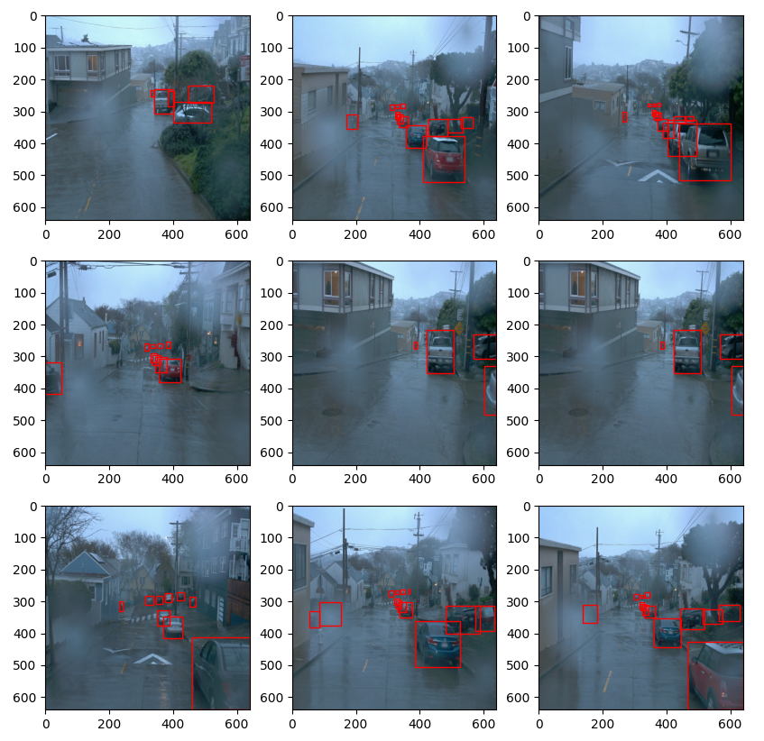
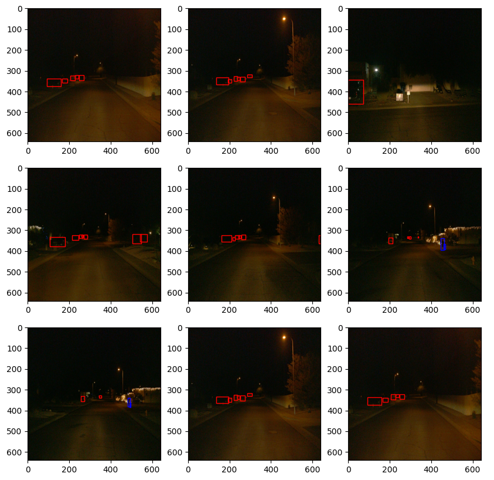
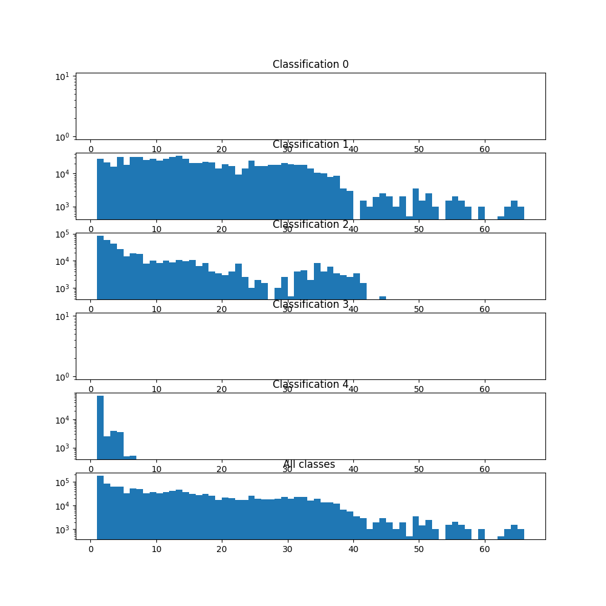
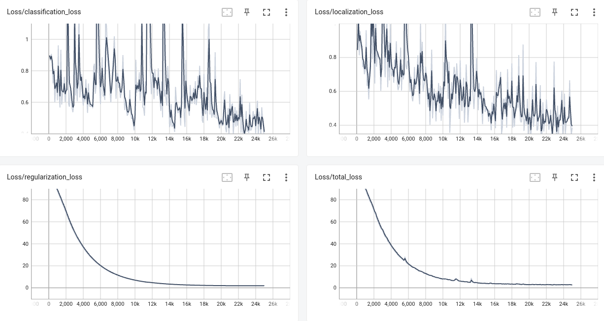

# Object Detection in an Urban Environment

## Data

For this project, we will be using data from the [Waymo Open dataset](https://waymo.com/open/).

[OPTIONAL] - The files can be downloaded directly from the website as tar files or from the [Google Cloud Bucket](https://console.cloud.google.com/storage/browser/waymo_open_dataset_v_1_2_0_individual_files/) as individual tf records. We have already provided the data required to finish this project in the workspace, so you don't need to download it separately.

## Structure

### Data

The data you will use for training, validation and testing is organized as follow:
```
/home/workspace/data/waymo
    - training_and_validation - contains 97 files to train and validate your models
    - train: contain the train data (empty to start)
    - val: contain the val data (empty to start)
    - test - contains 3 files to test your model and create inference videos
```

The `training_and_validation` folder contains file that have been downsampled: we have selected one every 10 frames from 10 fps videos. The `testing` folder contains frames from the 10 fps video without downsampling.

You will split this `training_and_validation` data into `train`, and `val` sets by completing and executing the `create_splits.py` file.

### Experiments
The experiments folder will be organized as follow:
```
experiments/
    - pretrained_model/
    - exporter_main_v2.py - to create an inference model
    - model_main_tf2.py - to launch training
    - reference/ - reference training with the unchanged config file
    - experiment0/ - create a new folder for each experiment you run
    - experiment1/ - create a new folder for each experiment you run
    - experiment2/ - create a new folder for each experiment you run
    - label_map.pbtxt
    ...
```

## Prerequisites

### Local Setup

For local setup if you have your own Nvidia GPU, you can use the provided Dockerfile and requirements in the [build directory](./build).

Follow [the README therein](./build/README.md) to create a docker container and install all prerequisites.

### Download and process the data

**Note:** ”If you are using the classroom workspace, we have already completed the steps in the section for you. You can find the downloaded and processed files within the `/home/workspace/data/preprocessed_data/` directory. Check this out then proceed to the **Exploratory Data Analysis** part.

The first goal of this project is to download the data from the Waymo's Google Cloud bucket to your local machine. For this project, we only need a subset of the data provided (for example, we do not need to use the Lidar data). Therefore, we are going to download and trim immediately each file. In `download_process.py`, you can view the `create_tf_example` function, which will perform this processing. This function takes the components of a Waymo Tf record and saves them in the Tf Object Detection api format. An example of such function is described [here](https://tensorflow-object-detection-api-tutorial.readthedocs.io/en/latest/training.html#create-tensorflow-records). We are already providing the `label_map.pbtxt` file.

You can run the script using the following command:
```
python download_process.py --data_dir {processed_file_location} --size {number of files you want to download}
```

You are downloading 100 files (unless you changed the `size` parameter) so be patient! Once the script is done, you can look inside your `data_dir` folder to see if the files have been downloaded and processed correctly.

### Classroom Workspace

In the classroom workspace, every library and package should already be installed in your environment. You will NOT need to make use of `gcloud` to download the images.

## Instructions

### Exploratory Data Analysis

You should use the data already present in `/home/workspace/data/waymo` directory to explore the dataset! This is the most important task of any machine learning project. To do so, open the `Exploratory Data Analysis` notebook. In this notebook, your first task will be to implement a `display_instances` function to display images and annotations using `matplotlib`. This should be very similar to the function you created during the course. Once you are done, feel free to spend more time exploring the data and report your findings. Report anything relevant about the dataset in the writeup.

Keep in mind that you should refer to this analysis to create the different spits (training, test and validation).


### Create the training - validation splits
In the class, we talked about cross-validation and the importance of creating meaningful training and validation splits. For this project, you will have to create your own training and validation sets using the files located in `/home/workspace/data/waymo`. The `split` function in the `create_splits.py` file does the following:
* create three subfolders: `/home/workspace/data/train/`, `/home/workspace/data/val/`, and `/home/workspace/data/test/`
* split the tf records files between these three folders by symbolically linking the files from `/home/workspace/data/waymo/` to `/home/workspace/data/train/`, `/home/workspace/data/val/`, and `/home/workspace/data/test/`

Use the following command to run the script once your function is implemented:
```
python create_splits.py --data-dir /home/workspace/data
```

### Edit the config file

Now you are ready for training. As we explain during the course, the Tf Object Detection API relies on **config files**. The config that we will use for this project is `pipeline.config`, which is the config for a SSD Resnet 50 640x640 model. You can learn more about the Single Shot Detector [here](https://arxiv.org/pdf/1512.02325.pdf).

First, let's download the [pretrained model](http://download.tensorflow.org/models/object_detection/tf2/20200711/ssd_resnet50_v1_fpn_640x640_coco17_tpu-8.tar.gz) and move it to `/home/workspace/experiments/pretrained_model/`.

We need to edit the config files to change the location of the training and validation files, as well as the location of the label_map file, pretrained weights. We also need to adjust the batch size. To do so, run the following:
```
python edit_config.py --train_dir /home/workspace/data/train/ --eval_dir /home/workspace/data/val/ --batch_size 2 --checkpoint /home/workspace/experiments/pretrained_model/ssd_resnet50_v1_fpn_640x640_coco17_tpu-8/checkpoint/ckpt-0 --label_map /home/workspace/experiments/label_map.pbtxt
```
A new config file has been created, `pipeline_new.config`.

### Training

You will now launch your very first experiment with the Tensorflow object detection API. Move the `pipeline_new.config` to the `/home/workspace/experiments/reference` folder. Now launch the training process:
* a training process:
```
python experiments/model_main_tf2.py --model_dir=experiments/reference/ --pipeline_config_path=experiments/reference/pipeline_new.config
```
Once the training is finished, launch the evaluation process:
* an evaluation process:
```
python experiments/model_main_tf2.py --model_dir=experiments/reference/ --pipeline_config_path=experiments/reference/pipeline_new.config --checkpoint_dir=experiments/reference/
```

**Note**: Both processes will display some Tensorflow warnings, which can be ignored. You may have to kill the evaluation script manually using
`CTRL+C`.

To monitor the training, you can launch a tensorboard instance by running `python -m tensorboard.main --logdir experiments/reference/`. You will report your findings in the writeup.

### Improve the performances

Most likely, this initial experiment did not yield optimal results. However, you can make multiple changes to the config file to improve this model. One obvious change consists in improving the data augmentation strategy. The [`preprocessor.proto`](https://github.com/tensorflow/models/blob/master/research/object_detection/protos/preprocessor.proto) file contains the different data augmentation method available in the Tf Object Detection API. To help you visualize these augmentations, we are providing a notebook: `Explore augmentations.ipynb`. Using this notebook, try different data augmentation combinations and select the one you think is optimal for our dataset. Justify your choices in the writeup.

Keep in mind that the following are also available:
* experiment with the optimizer: type of optimizer, learning rate, scheduler etc
* experiment with the architecture. The Tf Object Detection API [model zoo](https://github.com/tensorflow/models/blob/master/research/object_detection/g3doc/tf2_detection_zoo.md) offers many architectures. Keep in mind that the `pipeline.config` file is unique for each architecture and you will have to edit it.

**Important:** If you are working on the workspace, your storage is limited. You may to delete the checkpoints files after each experiment. You should however keep the `tf.events` files located in the `train` and `eval` folder of your experiments. You can also keep the `saved_model` folder to create your videos.


### Creating an animation
#### Export the trained model
Modify the arguments of the following function to adjust it to your models:

```
python experiments/exporter_main_v2.py --input_type image_tensor --pipeline_config_path experiments/reference/pipeline_new.config --trained_checkpoint_dir experiments/reference/ --output_directory experiments/reference/exported/
```

This should create a new folder `experiments/reference/exported/saved_model`. You can read more about the Tensorflow SavedModel format [here](https://www.tensorflow.org/guide/saved_model).

Finally, you can create a video of your model's inferences for any tf record file. To do so, run the following command (modify it to your files):
```
python inference_video.py --labelmap_path label_map.pbtxt --model_path experiments/reference/exported/saved_model --tf_record_path /data/waymo/testing/segment-12200383401366682847_2552_140_2572_140_with_camera_labels.tfrecord --config_path experiments/reference/pipeline_new.config --output_path animation.gif
```

## Submission Template

### Project overview
Machine learning algorithms are the nowadays fundamentals of self driving cars. While decades ago the first attempts were only based
on classical image detection algorithms. These just gave limiting results. They were actually quite acceptable in terms of object/obstacle avoidance.
But they were extremely limited when it comes to object tracking. Without a reasonable classification of the detected objects/obstacles
it is impossible to react properly on each detection and to create driving profiles.

First when the machine learning algorithms were good enough and computers fast enough, the uprise of self-driving cars 
found its way back to common research and afterwards to industrialization. 

In this project, we are going to apply all out newly gained knowledge about neural-network based computer vision.
We take the data from the Waymo open dataset. We start with an analysis of the data. This is crucial to find potential bias
in the data and to see for which scenarios the network is trained.\
Afterwards, we train a predefined model and tweak its performance by augmentation of the dataset and the varying learning rates, schedulers and potential network changes.


### Set up
This section should contain a brief description of the steps to follow to run the code for this repository.

### Dataset
#### Dataset analysis
To get a good overview of the data we perform first an exploratory data analysis (EDA). This is a crucial step to get a feeling for the data we deal with.
But not only the feeling for the data is important, but we check on which scenarios we train our network. 
Is there any bias (weather, scenes, daytime, country, location, distribution of classes, format, over-/under-representation, ...)? And also the similarity of training, validation and test set is examined.
If they are very similar, we could not make assumptions about the generality of predictions from our network. They must not be related to training set.

##### Procedure:
We visualized 10 images at once of a single dataset together with its bounding boxes and classification. This was done repeated times with random images from the dataset.\
This procedure was repeated for several datasets from the training, validation and test folder.

##### Findings:
Dataset 1 (train):\
All scenes are in cloudy, rainy and urban conditions. From the randomly depicted images we could only see camera classifications.
We are clearly in a country with ride-sided traffic. Therefore, most car classifications are located on the right side of the image.
This however, is a general observation. So it might imply a bias on the image classification network and might result
in a worse car classification if the car is on the left side. So this might pose a loss of generality.
However, this is no point of investigation in the upcoming tasks.
Also, we mostly see cars from the back. Other datasets should contain also cars from other perspectives to achieve a general classification.


Dataset 2:\
The dataset was recorded at night in an urban environment. We only see few cars on the streets. The streetlights cause artefacts on the image.
Only cars are seen on the dataset. No pedestrians, cyclists or other traffic participants.

Dataset 3:\
The dataset was recorded at daytime with cloudy partially wet weather. The environment is a freeway. Here we also see trucks.

Dataset 4:\
The dataset was recorded at night a suburban environment. Here we also see pedestrians which are labeled.


In general, we can say, we see a broad distribution of weather and environmental conditions. Each dataset is a sequence of images from the same drive.
The distribution of labels is clearly towards cars (and trucks which are much fewer but with the same classification). 
Due to the low occurrence of e.g. cyclists or motorcycles, we might perform bad identifying such objects.

The three dataset categories (train, validation, test) differ sufficiently.

##### Statistical analysis:
We also analysed the distribution of classes along all frames within the training data set. We plot the results in the figure below.
You see a plot for each classification and for the sum over all classifications. On the x-axis is the number of found 
bounding boxes with this classification within a single frame. On the y-axis the number of frames which fulfill this condition.
The histogram shows, that we have a quite flat distribution of classification 1, which is car/truck up to 40 classifications per frame.
Above that the number of frames with such a high number of classifications get less. But some frames have up to 70 bounding boxes of that classification.
We also see lot's of classification 2 (pedestrian). None for classification 3. For classification 4 we have many with very few classifications per frame, but none with more than 10.


We have a similar distribution for the validation and test set.

#### Cross validation
To cross validate the results we split up the whole dataset into training and validation. 
The split is done 89:11. So 11% of the datasets were used for validation. The split is necessary as we can only get reliable
results, when evaluating on non-trained data. Otherwise, we would evaluate on fitted data and have no statement on the generality of our trained network.

### Training
#### Reference experiment
The basic training was run on the given dataset with 81 datasets (261 MB). On the figure below you can see the loss metrics. 
After 25000 (~40mins) steps we terminate. To this time the improvements to the loss are very little.

The performance is rather poor. So some work has to be done to improve the accuracy.

To get an impression check the following animation. Only few cars are detected. And no pedestrians are detected at all.


#### Improve on the reference
##### Experiment 1
At first, we try to add more augmentations. This virtually increases the diversity of the input dataset.
We used the following Augmentations:
```
  data_augmentation_options {
    random_horizontal_flip {
    }
  }
  data_augmentation_options {
    random_crop_image {
      min_object_covered: 0.0
      min_aspect_ratio: 0.75
      max_aspect_ratio: 3.0
      min_area: 0.75
      max_area: 1.0
      overlap_thresh: 0.0
    }
  data_augmentation_options {
    random_adjust_brightness {
    }
  }
  data_augmentation_options {
    random_adjust_hue {
    }
  }
  data_augmentation_options {
    random_adjust_saturation {
    }
  }
  data_augmentation_options {
    random_distort_color {
    }
  }
  data_augmentation_options {
    random_black_patches {
	max_black_patches: 10
	probability: 0.1
	size_to_image_ratio:0.7
    }
  }
```

random_horizontal_flip and random_crop_image were already used in the reference training.\
We chose the additional augmentations because of different reasons.
* using a varying brightness simulates different lighting conditions.
* varying hue emulates color changes of cars, pedestrians, ... . This way the network gets trained more on shapes, rather than on combinations of color.
* varying saturation and color distorion have a similar effect as the previous one.
* Adding black patches simulates the effects of dead spots in the camera sensor. These can be created by sensor errors as well as by dirt on the lens.

The results are now much better, but by far not yet perfect. We detect now much more cars, but still no pedestrians. 
Also, as before, the car directly in front of us is not detected.


##### Experiment 2
To further increase the dataset variance, we try now to use more data for training. Therefore, we download now 400 
datasets from the waymo-open-dataset (instead of previously 100). Additionally, we use every fifth frame instead of 
every tenth during processing. This increases the total amount of frames, but not the number of different scenes,
as these frames are quite similar.\
After the split we have ??? datasets remaining for training (?? GB). 
We keep the augmentations from the first experiment.